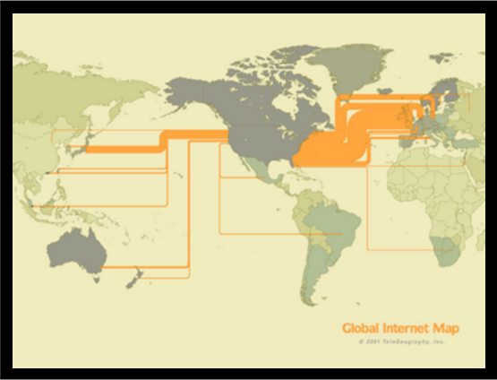

# FEWD LESSON 1

### Instructors
Kit Yuen & Mart van de Ven 


## Agenda

* Who we are?
* Course Information
* What is Web Development?
* How the Internet Works?
* HTML Basics
* HTML Tags
* Website File Structure
* Coding time!


## Who We Are?
<aside class="notes"></aside>

Kit Yuen

* Founder of QPon
* Freelancer
* Best practice engineer
* Traveler


## Who We Are?
<aside class="notes"></aside>

Mart Van De Ven

* Analytical Engineer, Demyst.Data
* MSc Information Design
* Social Media Apps
* G.U.I.D.E.
* Analytics Dashboard


## Course Information
<aside class="notes"></aside>

* Class Structure
* Final Project
* Grading Policy


## What is Web Development?
<aside class="notes"></aside>


## What is Web Development?
<aside class="notes"></aside>

Website

* Single page of plain text
* http://www.columbia.edu/~fdc/sample.html
* Text-based browser - lynx
* Rich user interface browsers - chrome, firefox


## What is Web Development?
<aside class="notes"></aside>

Web applications

* Online shop
* http://www.amazon.com 
* Social networks
* http://www.facebook.com


## What is Web Development?
<aside class="notes"></aside>

For simple static websites, web development can simply refer to:

* Writing markup: HTML
* Writing style: CSS
* Coding: Javascript


## What is Web Development?
<aside class="notes"></aside>

But for large web applications, it could involve hundreds of people working on different aspects including:

* Web design: Graphical designer
* GUI design (Graphical User Interface): UX designer
* Front End Web Development (Client side): Javascript developer, Flash developer
* Back End Web Development (Server side): PHP, Ruby, Python developer
* Database: Database engineer, Database administrator
* Code optimization: SEO engineer
* Testing: Test developer, QA
* Application deployment: Best practice engineer
* Web server setup & Security: Server administrator, Best practice engineer


## What is Web Development?
<aside class="notes"></aside>

How to maintain a project?

* Project management tool
* Bug tracker
* Version control


## HOW THE WEB WORKS
<aside class="notes"></aside>

<table>
  <tr>
    <td style="vertical-align: middle;">
      How does my code get to a users browser:
      <ul>
        <li>DNS Servers</li>
        <li>Web Servers</li>
        <li>Web Browsers</li>
        <li>CDN (Content Distribution Network)</li>
      </ul>
    </td>
    <td></td>
  </tr>
</table>


## HTML Basics
<aside class="notes"></aside>

* HTML: HyperText Markup Language
* The main markup language for creating web pages
* Manipulate text and image as the building blocks of websites


## HTML Basics
<aside class="notes"></aside>

* HTML5 is the fifth version of HTML standard
* More HTML elements are available
  * `<audio>`
  * `<video>`
  * `<canvas>`
* Other features
  * Drag and drop API
  * File API
  * Geolocation API
  * WebSocket API


## HTML Basics
<aside class="notes"></aside>

* Doctype also stands for Document Type Declaration (DTD) 
* Prior to HTML5, HTML is based on another markup language called SGML
  * SGML: Standard Generalized Markup Language 
* <!DOCTYPE> is not an HTML tag, it tells the browser the version of the HTML page
  * HTML 4.01 Strict
    * <!DOCTYPE HTML PUBLIC "-//W3C//DTD HTML 4.01//EN" "http:// www.w3.org/TR/html4/strict.dtd"> 
  * HTML 4.01 Transitional
    * <!DOCTYPE HTML PUBLIC "-//W3C//DTD HTML 4.01 Transitional//EN" "http://www.w3.org/TR/html4/loose.dtd">
* HTML5 is not based on SGML
  * <!DOCTYPE html>


## HTML Basics
<aside class="notes"></aside>

* Basic Document Structure

```
<!DOCTYPE html>
<html>
  <head>
    Document metadata
  </head>
  <body>
    Document contents
  </body>
</html>
```


## HTML Basics
<aside class="notes"></aside>

Syntax


## HTML Tags
<aside class="notes"></aside>

Syntax


## HTML Tags
<aside class="notes"></aside>

Text Elements

```
<p>This is a paragraph</p>
<br> (line break) <hr>
(horizontal rule)
<pre>This text is reformatted</pre>
```


## HTML Tags
<aside class="notes"></aside>

Heading Elements

```
<h1>Largest Heading</h1>
<h2> . . . </h2>
<h3> . . . </h3>
<h4> . . . </h4>
<h5> . . . </h5>
<h6>Smallest Heading</h6>
```


## HTML Tags
<aside class="notes"></aside>

Ordered list

```
<ol>
  <li>First item</li>
  <li>Next item</li>
</ol>
```


## HTML Tags
<aside class="notes"></aside>

Unordered list

```
<ul>
  <li>First item</li>
  <li>Next item</li>
</ul>
```


## HTML Tags
<aside class="notes"></aside>

Text Elements

```
<em>This text is emphasized</em>
<strong>This text is strong</strong>
<code>This is some computer code</code>
```


## HTML Tags
<aside class="notes"></aside>

Definition list

```
<dl>
  <dt>First term</dt>
  <dd>Definition</dd>
  <dt>Next term</dt>
  <dd>Definition</dd>
</dl>
```


## HTML Tags
<aside class="notes"></aside>

Deprecated Tags (Don't use it)

```
<b>This text is bold</b>
<i>This text is italic</i>
```


## Website File Structure
<aside class="notes"></aside>


## Coding time!
<aside class="notes"></aside>

Labs

* intro
* lostCat
* cookieMonster