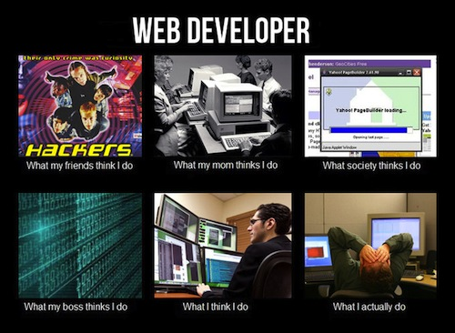

# FEWD LESSON 1

## Overview and HTML

### Instructors
Kit Yuen & Mart van de Ven 

## Agenda

* Round of Introductions
* Course Information
* What is Web Development?
* Text Editor
* Git & Github

## Who we are
<aside class="notes">Kit ~ 3 Min</aside>

Kit Yuen

* Founder of QPon
* Freelancer
* Best practice engineer
* Traveler

## Who we are
<aside class="notes">Mart ~ 3 Min</aside>

Mart van de Ven

* Analytical Engineer, DemystData
* MSc Information Design
* G.U.I.D.E.
* Coding as Prism
* Open Source & Open Data

## ... and who do we have here?
<aside class="notes">Class ~ 4 Min</aside>

* Tell us a bit about yourselves
* What are you hoping to achieve
* Already have any plans for your project?
* Fill out the [GA Student Profile](https://generalassembly.wufoo.com/forms/k4k4r7/)!

## Course Information
<aside class="notes">Kit ~ 3 Min</aside>

* Class Structure
* Final Project
* Grading Policy

## Course Flow
<aside class="notes">Mart ~ 3 Min</aside>

* Visit [tijptjik.github.io/FEWD/slides/?lesson=1](http://tijptjik.github.io/FEWD/slides/?lesson=1) for the slides
* Visit [github.com/tijptjik/FEWD/](https://github.com/tijptjik/FEWD/blob/gh-pages/lesson1/slides.md) for the notes
* Or check the slides markdown file in your local FEWD repository.  
* Ask questions via Schoology, E-mail, or Github Issues.
* Setup Google+ to receive e-mail notifications if you haven't already

## What is Web Development?
<aside class="notes">Kit ~ 12 Min</aside>

## What is Web Development?
<aside class="notes"></aside>

Website

* Single page of plain text
* http://www.columbia.edu/~fdc/sample.html
* Text-based browser - lynx
* Rich user interface browsers - chrome, firefox

## What is Web Development?
<aside class="notes"></aside>

Web applications

* Online shop
* http://www.amazon.com 
* Social networks
* http://www.facebook.com

## What is Web Development?
<aside class="notes"></aside>

For a static website, web development can simply refer to:

* Writing markup: HTML
* Writing style: CSS
* Coding: Javascript

## What is Web Development?
<aside class="notes"></aside>

But for large web applications, it could involve hundreds of people working on different aspects including:

* Web design: Graphical designer
* GUI design (Graphical User Interface): UX designer
* Front End Web Development (Client side): Javascript developer, Flash developer
* Back End Web Development (Server side): PHP, Ruby, Python developer
* Database: Database engineer, Database administrator
* Code optimization: SEO engineer
* Testing: Test developer, QA
* Application deployment: Best practice engineer
* Web server setup & Security: Server administrator, Best practice engineer

## What is Web Development?
<aside class="notes">Mart ~ 3 Min</aside>

Developer Tools

* Text Editor / Integrated Development Environment
* Automated Test Suits
* Deployment Tools

Project Management Tools

* Project management tool
* Bug tracker
* Version control

## Text Editor
<aside class="notes">Mart ~ 10 Min</aside>
[SublimeText2](http://www.sublimetext.com/2)

* [Package Control](http://wbond.net/sublime_packages/package_control/installation)
* Create a project
* introduce yourself to `p`.
* Try to make a good first impression.
* You will love `p`.
* [Hacks](http://hexlator.blogspot.hk/2013/05/best-sublime-text-2-tips-tricks-hacks.html), [Tips](http://net.tutsplus.com/articles/news/perfect-workflow-in-sublime-text-free-course/) & [Tricks](http://net.tutsplus.com/tutorials/tools-and-tips/sublime-text-2-tips-and-tricks/)

## Version Control
<aside class="notes">Mart ~ 60 Min</aside>

### [Git](https://help.github.com/articles/set-up-git)
For [Mac](http://mac.github.com/) and [Windows](http://windows.github.com/)

* Sign-up with [GitHub](https://github.com/signup/free)
* `fork` the [FEWD repository](https://github.com/tijptjik/FEWD)
* [Clone](http://support.fastpdfkit.com/kb/how-to/how-to-clone-from-github) your GitHub copy to your local machine
* [Pave the way](https://help.github.com/articles/making-changes) for your final project
* Serve your website with [GitHub Pages](https://help.github.com/articles/creating-project-pages-manually)
* [Marvel](https://github.com/) at your mastery over Git
* ... the most complicated tool built by mankind

## Git Concepts
<aside class="notes">Mart ~ 10 Min
Provide a high-level overview of the work-flow in Git by talking about how the following items make distirbuted collaboration possible</aside>

### The Hash
### The Branch
### The Diff
### The Merge

## Homework
<aside class="notes"></aside>

Make yourself at home with your new web developer toolkit! 

* Check-out GitHub, and play around with GitHub Issues.
* See if you can pick up some nifty SublimeText2 shortcuts.
* Post a little description about your project to the final/name/readme.md file so everyone know what you're planning for! No stress if you don't have anything yet, you can commit changes to your plan anytime :)

### Reading

* [The Evolution of the Web](http://www.evolutionoftheweb.com/?hl=en)
* [HTML | MDN](https://developer.mozilla.org/en-US/docs/HTML)
* [What really happens when you navigate to a URL](http://igoro.com/archive/what-really-happens-when-you-navigate-to-a-url/)
* [Advanced guide to using GIT on OSX](http://shaun.boyblack.co.za/blog/2009/03/14/getting-started-with-git-on-mac-os-x/)
