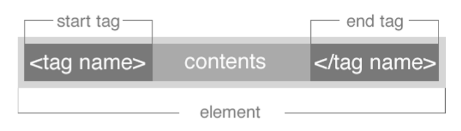
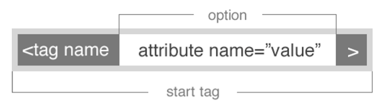
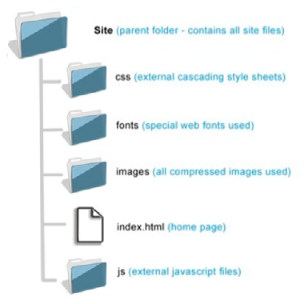
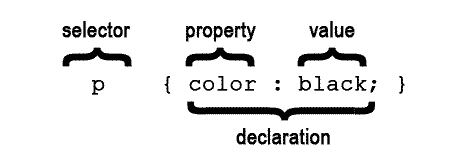

# FEWD LESSON 2

## HTML Basics & CSS

### Instructors
Kit Yuen & Mart van de Ven 


## Agenda

* Sync with `Upstream`
* HTML Basics
* HTML Tags
* Website File Structure
* Coding time! Lost cats!
* Show and tell: Introducing the HTML Template
* What is CSS?
* Page Layout & CSS
* CSS: Fonts & Text
* Color and Image file Types
* HTML Extended
* Cookiemonster


## Pointing with GIT: Origin & Upstream 
<aside class="notes">Both ~ 5 Min</aside>

Merge latest changes from tijptjik/FEWD to your forked repo

1. Open the Git shell / Terminal
1. Goes to your repository root
  * Win: `cd c:\Users\user\Desktop\FEWD`
  * OSX: `cd /Users/user/Desktop/FEWD`
1. Add tijptjik/FEWD as your upstream repo
  * `git remote add upstream https://github.com/tijptjik/FEWD.git`
1. Fetch new updates from the upstream repo to your machine
  * `git fetch upstream`
1. Merge the upstream commits to your local repo
  * `git merge upstream/gh-pages -m "YOUR COMMIT MSG"`
1. Push the new commits to your forked repo
  * `git push origin gh-pages`


## HTML Basics
<aside class="notes">Mart ~ 4 Min</aside>

* HTML: HyperText Markup Language
* The main markup language for creating web pages
* Manipulate text and image as the building blocks of websites


## HTML Basics
<aside class="notes"></aside>

* HTML5 is the fifth version of HTML standard
* More HTML elements are available
  * `<audio>`
  * `<video>`
  * `<canvas>`
* Other features
  * Drag and drop API
  * File API
  * Geolocation API
  * WebSocket API


## HTML Basics
<aside class="notes">Kit ~ 15 Min</aside>

* Doctype also stands for Document Type Declaration (DTD) 
* Prior to HTML5, HTML is based on another markup language called SGML
  * SGML: Standard Generalized Markup Language 
* `<!DOCTYPE>` is not an HTML tag, it tells the browser the version of the HTML page
  * HTML 4.01 Strict
    * `<!DOCTYPE HTML PUBLIC "-//W3C//DTD HTML 4.01//EN" "http:// www.w3.org/TR/html4/strict.dtd">`
  * HTML 4.01 Transitional
    * `<!DOCTYPE HTML PUBLIC "-//W3C//DTD HTML 4.01 Transitional//EN" "http://www.w3.org/TR/html4/loose.dtd">`
* HTML5 is not based on SGML
  * `<!DOCTYPE html>`
* [HTML <!DOCTYPE> Declaration](http://www.w3schools.com/tags/tag_doctype.asp)


## HTML Basics
<aside class="notes"></aside>

* Basic Document Structure

```
<!DOCTYPE html>
<html>
  <head>
    Document metadata
  </head>
  <body>
    Document contents
  </body>
</html>
```


## HTML Basics
<aside class="notes"></aside>

Syntax




## HTML Tags
<aside class="notes"></aside>

Syntax




## HTML Tags
<aside class="notes"></aside>

Text Elements

```
<p>This is a paragraph</p>
<br> (line break)
<hr> (horizontal rule)
<pre>This text is reformatted</pre>
```


## HTML Tags
<aside class="notes"></aside>

Heading Elements

```
<h1>Largest Heading</h1>
<h2> . . . </h2>
<h3> . . . </h3>
<h4> . . . </h4>
<h5> . . . </h5>
<h6>Smallest Heading</h6>
```


## HTML Tags
<aside class="notes"></aside>

Ordered list

```
<ol>
  <li>First item</li>
  <li>Next item</li>
</ol>
```


## HTML Tags
<aside class="notes"></aside>

Unordered list

```
<ul>
  <li>First item</li>
  <li>Next item</li>
</ul>
```


## HTML Tags
<aside class="notes"></aside>

Text Elements

```
<em>This text is emphasized</em>
<strong>This text is strong</strong>
<code>This is some computer code</code>
```


## HTML Tags
<aside class="notes"></aside>

Definition list

```
<dl>
  <dt>First term</dt>
  <dd>Definition</dd>
  <dt>Next term</dt>
  <dd>Definition</dd>
</dl>
```


## HTML Tags
<aside class="notes"></aside>

Deprecated Tags (Don't use it)

```
<b>This text is bold</b>
<i>This text is italic</i>
```


## HTML Tags
<aside class="notes"></aside>

Image

```

```


## HTML Tags
<aside class="notes"></aside>

Hyperlink

```
<a href="http://www.google.com">Google</a>
```


## Coding time!
<aside class="notes">Both ~ 20 Min</aside>

Labs

* intro
* lostCat


## Website File Structure
<aside class="notes">Kit ~ 2 Min</aside>




## Show and tell: Introducing the HTML Template
<aside class="notes"></aside>

```
<!doctype html> 
<html lang="en">  
  <head>  
    <meta charset="utf-8">  
    <meta name="description" content=""> 
    <title>Page Title</title>
    <link rel="stylesheet" href="css/style.css">
    <link rel="stylesheet" href="css/normalize.css">  
    <style></style> 
  <body>
    <!-- BODY -->
  </body>
</html>
```


## What is CSS?
<aside class="notes">Mart ~ 20 Min</aside>

Cascading Style Sheets (CSS) is the central place to define your page styling.

* It’s a style language
* Separates presentation from mark-up
* Powerful and concise selectors

<br>

[CSS Zen garden](http://www.csszengarden.com/)


## What is CSS?
<aside class="notes"></aside>

* Inline
```
<p style="color: red;"></p>
```
* Internal
```
<style>
  p { color: red; }
</style>
```
* External
```
<link rel="stylesheet" type="text/css" href="style.css">
```


## What is CSS?
<aside class="notes"></aside>

CSS Syntax




## What is CSS?
<aside class="notes"></aside>

* IMPORTANCE
* SPECIFICITY
* INHERITANCE


## What is CSS?
<aside class="notes"></aside>

What is our favorite styled web page?

* [Connected China](http://connectedchina.reuters.com/)
* [Google Glass](http://www.google.com/glass/start/)
* [mixpanel](https://mixpanel.com/)


## Page Layout & CSS
<aside class="notes">Both ~ 20 Min</aside>

Lab

* pageLayout


## CSS: Fonts & Text
<aside class="notes">Kit ~ 10 Min</aside>

font-size
```
body { font-size: 12px; }
```

Unit

* px
* em
* %


## CSS: Fonts & Text
<aside class="notes"></aside>

font-style

Allows italic or oblique faces to be selected within a font-family. 

```
body { font-style: italic; }
```


## CSS: Fonts & Text
<aside class="notes"></aside>

font-weight

```
body { font-weight: bold; }
```


## CSS: Fonts & Text
<aside class="notes"></aside>

text-decoration

```
body { text-decoration: underline; }
```


## CSS: Fonts & Text
<aside class="notes"></aside>

font-family

```
body { font-family: Helvetica, Arial, san-serif; }
```


## Color and Image file Types
<aside class="notes">Mart ~ 10 Min</aside>

* Names
* Hexadecimal
* RGB
* RGBA


## Color and Image file Types
<aside class="notes"></aside>

color

```
body { color: pink }
body { color: #f00 }
body { color: #ff0000 }
body { color: rgb(255,0,0) }
```


## Color and Image file Types
<aside class="notes"></aside>

### Name

There are 147 color names 16 of which are standard:

* aqua, black, blue
* fuchsia, gray/grey
* green, lime, maroon
* navy, olive, purple
* red, silver, teal
* white, yellow


## Color and Image file Types
<aside class="notes"></aside>

### Hexadecimal

These colors when used in different combinations can produce any color that is needed.

For example, in the color red, the color code is #FF0000, which is '255' red, '0' green, and '0' blue.

Hex system values use combinations of the characters 0-9 as well as A-F.

[Color Picker](http://www.colorpicker.com/)


## Color and Image file Types
<aside class="notes"></aside>

### RGB & RGBA

RGB (Red Green Blue)
* rgb(100,86,92);

<br>

A (Alpha) allows an additional accepted value from 0-1 (o%-100% opacity)
* rgba(100,86,92,0.5);


## Color and Image file Types
<aside class="notes"></aside>

Image Formats

* GIF (Graphics Interchange Format)
* JPG (JPEG) (Joint Photographic Experts Group)
* PNG (Portable Network Graphic)
* SVG (Scalable Vector Graphic)


## HTML Extended
<aside class="notes">Kit ~ 3 Min</aside>

* `<header>`
* `<footer>`
* `<aside>`
* `<article>`
* `<section>`

<br>

... coming in HTML 5.1

* `<main>`

<br>

[html5 Doctor](http://html5doctor.com)


## Coding time!
<aside class="notes"></aside>

1. Lab: `cookieMonster`
For review in class #03: Personalize the cookie monster project using your own content. 


## Homework Project
<aside class="notes"></aside>

Create a website for your favourite band consisting of at least 3 pages, featuring the various HTML elements and CSS properties introduced so far

* Use both HTML elements and CSS background images
* Embed at least 1 YouTube or Vimeo video
* Embed a Google Map on the band's tour page
* Push your project code to GitHub
* You will come to class #03 with your projects underway. We’ll answer any questions you may have. Your project will be submitted for review before class #04